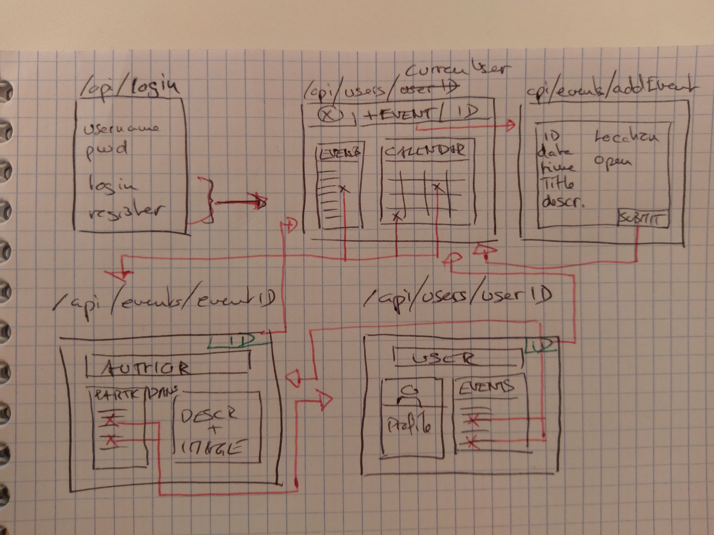
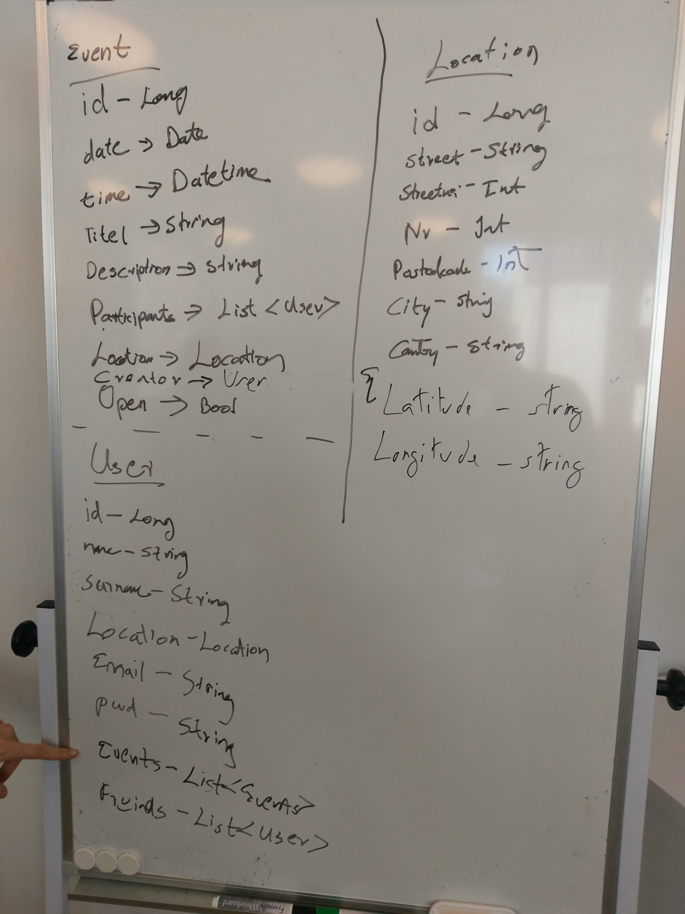

# Interactive-Calendar-App
Group Project with Spring and React-Redux

# First Mockup (OOA)
Agile, first version aims at fully functional list of events (no calendar display yet in the first stage)

### Elements of calendar application

* Event 
* User
* Location 

### Feature set of calendar application (Use Cases)

* Register 
* Login 
* Add Event to Calendar (List)
* Show Event (on Click) -> with Participant List)
* Show participant (other User, from event)

## OOD

## OOP

TBD ;)
